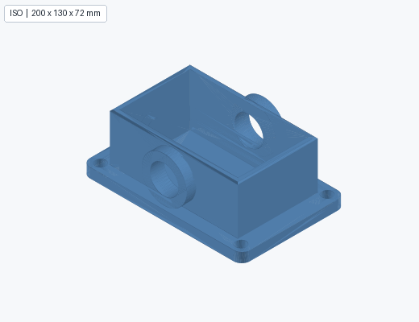
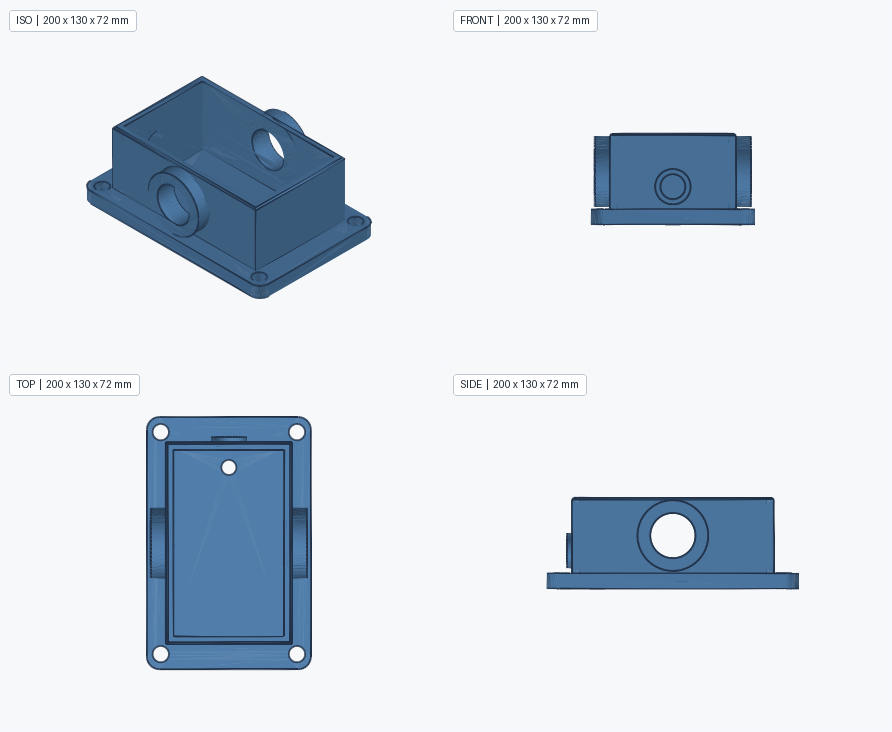
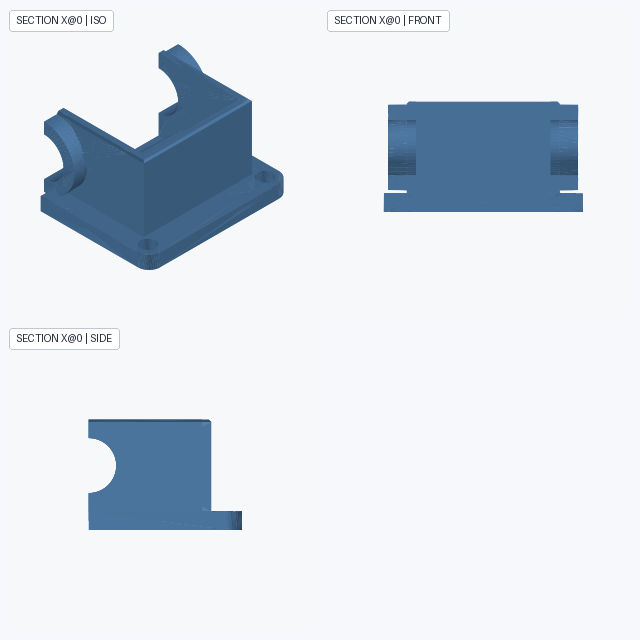
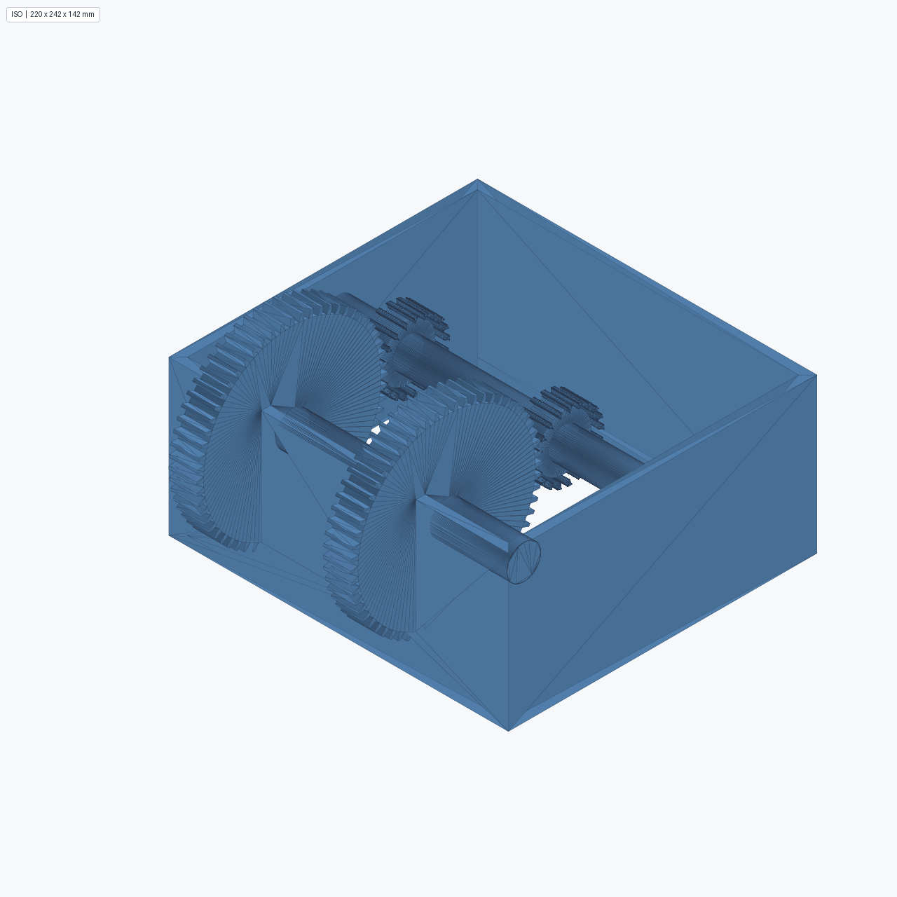
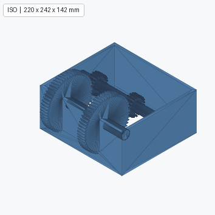
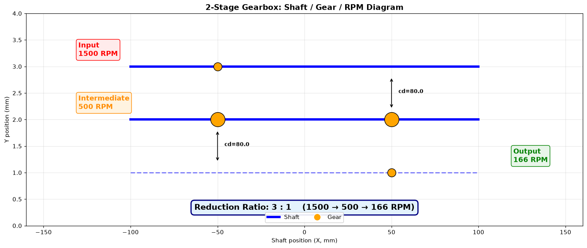
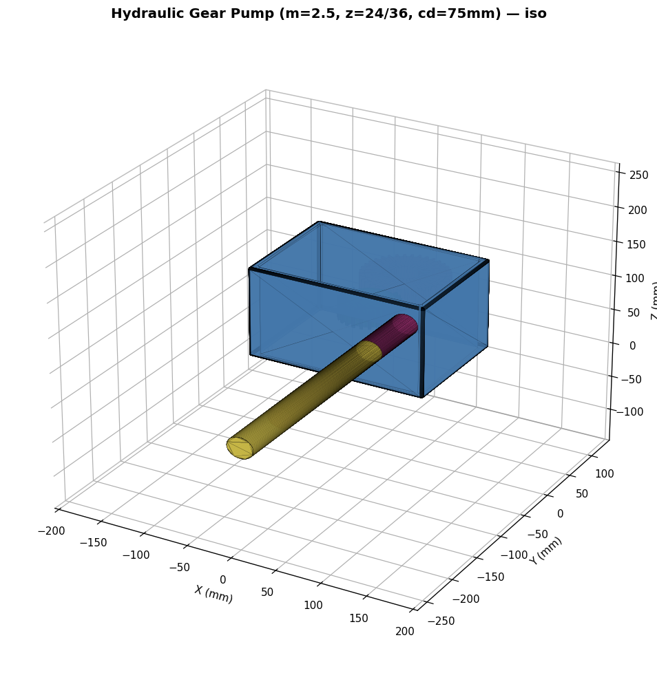
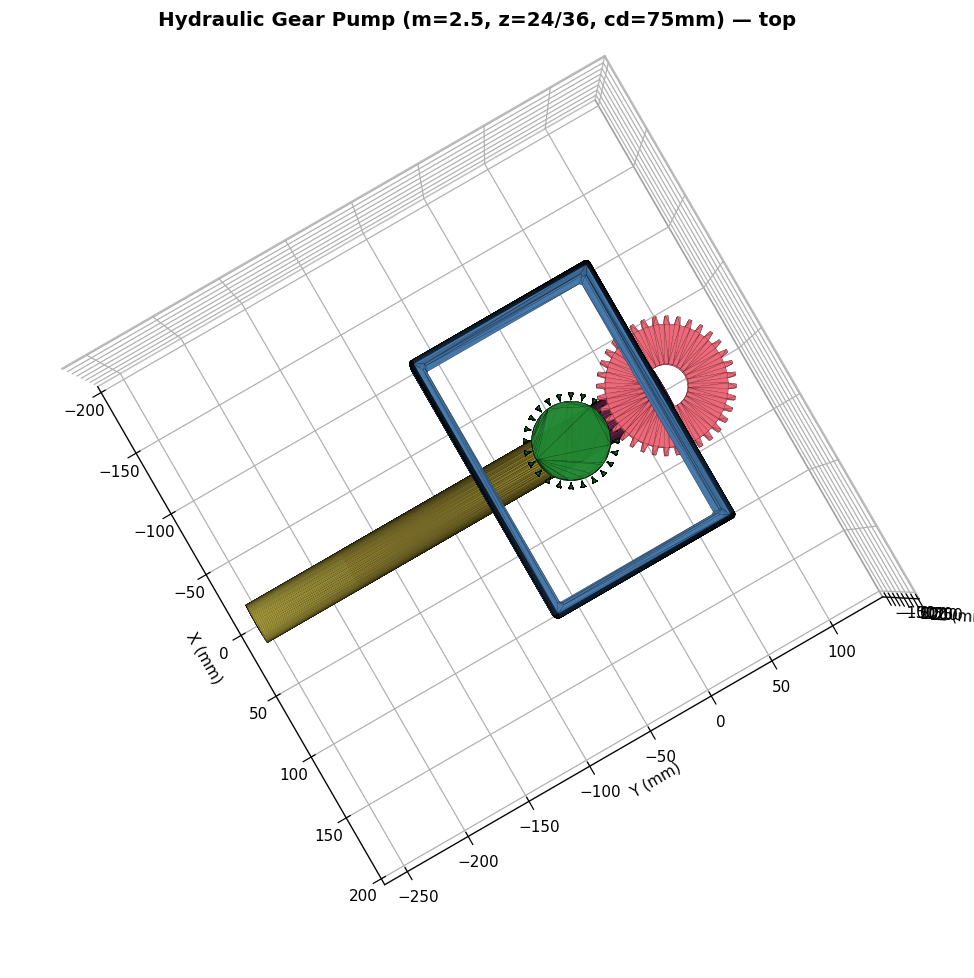
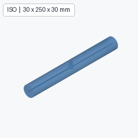

# MechCAD Kernel

> AI CAD 建模内核：让 LLM 通过自然语言/手绘草图生成真实 OCC 几何

[]()
[]()
[]()
[](LICENSE)
[]()

## 概述

MechCAD Kernel 是为 [MechCAD IDE](https://github.com/vanyu0710/aicad) 开发的**前体视觉建模内核**。它实现了"看→想→做→验"的拟人化建模流程，让 LLM 端到端生成可制造的 CAD 几何。

**核心能力 (v2.11)**：
- **33 op 默认公开 + 10 装配 op experimental**（全部真实实现）— 能力集聚焦零件建模主线
- 真实 OpenCascade (OCC) 几何 — 0% 体积误差（单次 boolean / 真弧线剖面）
- **v2.11 选边/选面闭环**: select 返回可回喂引用 (F03/E12) → fillet/chamfer 指定边 / shell 指定开口面 / 面上草图
- **v2.11 安全基线**: new_body 防护（不再静默清空零件）+ 结构化自修复建议 ({fix: {...}}) + cut 无切除警告
- **v2.11 草图强化**: custom/offset workplane 真实生效 + 面上草图 + 混合剖面真弧线（0 采样误差）
- **v2.11 hole 升级**: 任意面进入 (top/bottom/x±/y±) + countersink 真 90° 锥面
- Capability Registry (JSON Schema + few-shot) — LLM 知道"能做什么"
- 5 类类型化错误 + RecoverableError + 事务 Savepoint + 撤销/重做
- 实例私有 ID 生成器 — 多 kernel 实例同进程互不污染（harness 多会话就绪）
- 二维约束、命名参数、确定性重放、持久化与多视角证据
- OpenAI-compatible Vision + Chat Planner 端到端集成（DeepSeek 兼容保留）

## v2.11 零件建模全流程 (本次)

装配体功能降级（标记 experimental，代码冻结保留），聚焦零件建模主线：

- **选边/选面闭环**（新模块 `topology_refs.py`）: `select(element_type="edge")` 返回带几何摘要的可回喂引用 → `fillet(radius, edges=['E12','E15'])` / `chamfer` / `shell(face_refs=['F03'])` / `create_workplane(face_ref='F03')`（面上草图）。引用按几何 revision 校验新鲜度，过期引用返回 RECOVERABLE("re_select")。
- **安全基线**: `extrude/revolve/sweep mode='new_body'` 在已有几何时改为 RECOVERABLE + `confirm_replace=True` 逃生门（此前静默清空整个零件）；sweep 增加 mode (new_body/add/cut) 并支持 rectangle 剖面；linear_pattern/mirror/boolean 深度参数化（去掉硬编码 50，缺省取零件 Z 尺寸+2mm 并附 warning）。
- **草图强化**: `create_workplane(type='custom', origin, normal)` 参数真实生效（修复丢弃 bug）；基准面 `offset` 偏置；混合轮廓 (line+arc) 走 build123d 真弧线 wire（半圆盘体积 0 误差，此前 5° 采样折线 ~0.13% 误差），失败自动回退采样并附 warning。
- **hole 升级**: `direction` 支持从任意面进入 (top/bottom/x+/x-/y+/y-)；countersink 真 90° 锥面（此前是直壁假沉头）。
- **harness 接口准备**: ID 生成器实例化（多 MechKernel 实例同进程互不污染）；RecoverableError 类型化异常 + suggestion 统一 `{action, fix: {param: value}, reason_code}`（LLM 可直接改参重试）；unknown field 错误附 valid_fields；cut 无切除时警告；修复 orchestrator 重试合并 bug；reference frame 入快照/存档。
- **装配 10 op 标记 experimental**: `PUBLIC_OPS` 43→33 + `EXPERIMENTAL_OPS`；execute() 默认拒绝、`allow_experimental=True` 放行；LLM 默认能力集不再包含装配 op。

### v2.11 可视化（端到端复杂零件）

多步复杂零件全部走 v2.11 公开 API：选边/选面引用、偏置/自定义 workplane、命中选择、任意面打孔、真弧线剖面。

**Demo 16 — 单级减速器箱座（下箱体）**（仅公开 API，11 步特征）
> 箱体毛坯→底板→内腔切削→4 条底棱倒圆→2 轴承凸台→2 轴承孔→4 底脚螺栓→排油孔→油标凸台→油标孔→顶缘倒角

| iso | 多视图 | 剖面 |
|---|---|---|
|  |  |  |

**Demo 14 — 两级减速齿轮箱**（装配 + 碰撞检查）
> 4 真实齿轮 + 3 轴 + 中空外壳 + 参考坐标系 + 装配验证 + 碰撞报告 + RPM 标注

| presentation | iso | 减速比 |
|---|---|---|
|  |  |  |

**Demo 15 — 复杂液压齿轮泵**（v2.10，真实 involute 齿轮 + 装配 + 碰撞）
> 2 段齿轮泵：input 24 齿 → output 36 齿（1.5:1），module=2.5，真 involute 曲线，中空 housing + 4 mount + 6 bolt + 2 oil port

| 3D iso | 3D top | iso |
|---|---|---|
|  |  |  |

## v2.9.1 专家审查修复

基于 DeepSeek gpt-5.4-mini 专家审查 + 自我审查 (13 findings: 1 P0 + 6 P1 + 6 P2)，已修：

- **P0** `assemble()` `local_origin` 死代码简化 (`position or [...]` → `position`)
- **P1** `coaxial` 校验现在允许反向 (齿轮啮合需要 `|dot| > 1-eps`); 加 `coaxial_aligned` 严格模式
- **P1** `collision.check_pair_interference()` 加 `strict=False` 参数, 区分 expected (`ValueError/TypeError/AttributeError`) vs unexpected `Exception`
- **P1** `reference_frames.resolve_placement()` 旋转语义 docstring 详细化 (axis 是世界轴, 合成 `R @ base`)
- **P2** `gear.py` docstring 加 WARNING: 梯形齿形是 proxy, 真实啮合有 100-500mm³ 假干涉
- **测试**: + 3 新测试 (v7.1: 旋转语义, coaxial 反向, coaxial_aligned 严格)

## v2.9 碰撞检查

新增 `mech_kernel/collision.py` — 用 build123d `Part & Part` (OCC `BRepAlgoAPI_Common`) 算 boolean intersection:

```python
from mech_kernel.collision import check_pair_interference, check_assembly_interference, check_interference_matrix
from build123d import Box

# 单对
r = check_pair_interference(Box(10, 10, 10), Box(5, 5, 5))
# {"name_a": "A", "name_b": "B", "interfering": True, "volume_mm3": 125.0, "center": (..., ..., ...)}

# 装配体
parts = [("A", Box(10, 10, 10)), ("B", Box(5, 5, 5)), ("C", Box(5, 5, 5).moved(Location((20, 0, 0))))]
r = check_assembly_interference(parts, only_interfering=True)
# {"total_pairs": 3, "interfering_count": 1, "max_interference_volume": 125.0, ...}

# MechKernel 集成
k.check_interference(parts, tolerance=0.001, only_interfering=False)  → StepResult
```

**算法**: OCC `BRepAlgoAPI_Common` → volume > tolerance = 干涉. **性能**: 7 parts × 21 pairs ≈ 200ms, **O(N²) 复杂度**, 100 parts 估 ~20-30s (v2.10 加 AABB broad-phase).

**Demo 14 v3.1 真实碰撞报告** (7 parts):
```
total pairs: 21
interfering: 7
max interference vol: 8275.92 mm³
  housing        ↔ gear_intermediate_large : 8275.92 mm³ @(-41, 97, 10)
  housing        ↔ gear_intermediate_small : 8275.92 mm³ @( 59, 97, 10)
  gear_input     ↔ gear_intermediate_large :  307.50 mm³ @(-41, 20, 30)  ← 啮合
  gear_inter_small ↔ gear_output          :  307.50 mm³ @( 59, 20, 30)  ← 啮合
  shaft_input    ↔ gear_input             :   23.21 mm³
  shaft_inter    ↔ gear_intermediate_large:   43.88 mm³
  shaft_inter    ↔ gear_intermediate_small:   43.88 mm³
```

3 类干涉: housing 切齿轮 8275mm³ (真问题), 齿轮啮合 307mm³ (预期接触, 梯形齿形 proxy), 轴穿齿轮孔 23-44mm³ (boolean union 行为).

## v2.8 真实齿轮数学模型

新增 `mech_kernel/gear.py` 模块 — `build_involute_gear(module, teeth, width, bore)`：

- **严格 ISO 6336-1 / AGMA 2015 几何参数**：
  - `pitch_radius = m·z/2`
  - `addendum_radius = r + m`
  - `dedendum_radius = r − 1.25·m`
  - `base_radius = r·cos(α)` （默认 α=20°）
  - `tooth_thickness_at_pitch = π·m/2`
  - `center_distance(z1, z2) = m·(z1+z2)/2`
- **梯形齿形 proxy**：每齿 4 关键点 (左base / 左top / 右top / 右base)，顶宽 50%
  - 替代方案 build123d 真实 involute 曲线时 OCP 边界精度问题 (`TopoDS::Face` 异常)
  - ⚠️ 已知限制: 啮合时有 ~100-500 mm³ 假干涉 (梯形 vs 真圆齿)
  - 真实 involute 留给 v2.10
- **bore 自动 subtract**（`Mode.SUBTRACT`）：减少体积与理论 bore_vol 误差 < 1%
- **z ∈ [6, 100]** 全部齿数都跑通，速度 0.16-0.49s/件

### Demo 14 v2.8.4: 真实齿轮齿形 + in-kernel 装配

替换 4 个齿轮 + housing + 3 根轴后, **完全 in-kernel build123d 建模** (不再是 load STEP + translate), 视觉从中空外壳 + 3 根轴 + 4 个啮合齿轮 + RPM 标注 + 减速比 3:1 (input 1500 → intermediate 500 → output 166 RPM).


## v2.7 参考坐标系与装配验证

新增 5 个公开 op, 把 demo 14 升到语义化装配：

| op | 作用 |
|----|------|
| `create_reference_plane(name, origin, normal, x_axis, parent, metadata)` | 创建命名右手坐标系; 自动正交化, parent 链校验 |
| `query_reference(name=None)` | 查询单/全部 frame |
| `resolve_point(frame, uv, normal_offset)` | `{frame, uv, normal_offset}` 形式 → 世界坐标 |
| `resolve_placement(frame, uv, normal_offset, rotation)` | 返回 (world_origin, 3x3 rotation_matrix) |
| `validate_assembly(level, relations)` | 校验共轴/平行/垂直/齿轮啮合/装配完整性 |

支持的关系 kind: `coaxial` / `coaxial_aligned` / `parallel` / `perpendicular` / `clearance` / `mounted` / `inside` / `gear_mesh`.

> **v2.7.1 修复**: `coaxial` 现在允许反向 (`|dot| > 1-eps`, 齿轮啮合/轴对中等); `coaxial_aligned` 严格同向

### Demo 14 v2.7-v2.8.4: 5 个 reference frame, 13 个装配实例

```
world
├── housing_mount_plane
├── input_shaft_axis     (normal=(1,0,0), 沿 +X)
├── intermediate_shaft_axis
└── output_shaft_axis
```

所有 13 个 instance 都通过 `mount_frame` + `resolve_placement` 放置, 不再硬编码坐标.

`validate_assembly(level="standard", relations=10)` → `ok=True issues=0`.

## v2.6 几何可靠性验证与严格回滚

所有拓扑操作在事务提交前进行几何验证；无效候选结果严格回滚，不留下 feature 或历史记录。`validate_geometry(target, level)` 支持 `basic`、`standard` 和 `strict`，结果包含稳定 `reason_codes`、几何摘要和确定性 fingerprint。history 文件保存验证结果，重放/加载时校验体积和 fingerprint。

## v2.5 专业渲染与实例级装配

渲染支持 `backend="auto"|"occ"|"matplotlib"`、evidence/presentation 质量、分色装配实例、隐藏/高亮、四视图/转台和真实截面。Windows 无头环境无法建立 OCC 图形上下文时自动回退 matplotlib，并在 `evidence_manifest` 中保留 warning，不伪造 OCC 成功。

装配保留融合后的 STEP 几何，同时保存实例级 `id/name/color/visible/bbox` 元数据。`query_assembly`、`set_instance_visibility` 和 `set_instance_color` 只影响视觉场景，不改变 `_current_geometry`，也不进入参数化重放历史。

## v2.4 约束参数化与生产力基准

草图约束支持 `coincident`、`horizontal`、`vertical`、`parallel`、`perpendicular`、`distance`、`radius` 和 `equal`。命名尺寸通过 `set_parameter` 修改后会触发全量历史重放；严格模式失败回滚，`best_effort` 返回冲突和欠约束诊断。

项目保存为 STEP、`graph.json` 和 `history.json`。缺少或校验失败的历史不会覆盖已加载的 STEP 几何，而是返回 `RECOVERABLE`。

## 🎨 实际产出（端到端真实几何）

### 基础件
| 圆盘 (Ø100×20) | L 形支架 (80+10) | 沉头孔板 (带 2 切) |
|---|---|---|
|  |  |  |

### 多步骤件
| 轴向通孔轴 (Ø40×80 + 横向 Ø10) | 法兰盘 + 6 孔 + 圆角 |
|---|---|
|  |  |

### Boolean op (v1.7)
| Union (40×30 + 30×20) | Subtract (多 tool) | Intersect (盒 ∩ 圆柱) | L 形 (union + fillet) |
|---|---|---|---|
|  |  |  |  |

### 高频 op (v1.8-1.10)
| Hole (4 角) | Mirror (左右对称) | Linear Pattern (8 孔) |
|---|---|---|
|  |  |  |

### Query / Select / Measure (v1.11-1.15)


> **0% 体积误差**（单次 boolean）— 所有 demo 体积与理论值高度一致

## 快速开始


```python
from mech_kernel import MechKernel
import math

# 1. 造一个 Ø100×20 圆盘
k = MechKernel()
k.create_workplane('XY', 'XY')
k.new_sketch('XY', 'sk')
k.add_circle('sk', center=[0, 0], radius=50)
k.close_sketch('sk')
k.extrude('sk', depth=20, mode='new_body', name='disc')

# 2. 查询
print(k.query('_current_geometry', 'volume').value)         # 314159.27
print(k.query('_current_geometry', 'bounding_box').value)  # dict 8 keys
print(k.query('_current_geometry', 'face_count').value)     # 1

# 3. 简单孔 (v1.8)
k.hole(position=(0, 0), diameter=20)

# 4. 沉头孔
k.hole(position=(20, 20), diameter=10, hole_type='counterbore',
       counterbore_diameter=20, counterbore_depth=5)

# 5. 镜像复制 (v1.9)
k.new_sketch('XY', 'left_hole')
k.add_circle('left_hole', center=[-30, 0], radius=3)
k.close_sketch('left_hole')
k.mirror('left_hole', axis='Y', mode='cut')

# 6. 线性阵列 (v1.10)
k.new_sketch('XY', 'slot_hole')
k.add_circle('slot_hole', center=[0, 0], radius=2)
k.close_sketch('slot_hole')
k.linear_pattern('slot_hole', count=8, direction=(1, 0), spacing=10, mode='cut')

# 7. 圆角 (v1.4)
k.fillet(1.5, edges='all')

# 8. 测量
print(k.measure('(0, 0, 0)', '(50, 30, 7.5)', 'distance').value['distance'])  # 58.79

# 9. 选面 (按类型)
print(k.select('cylinder').value['selected'])  # 圆柱面列表

# 10. 导出 STEP
k.export('flange.step', format='step')
```

## 架构

```
┌────────────────────────────────────────────────────────────┐
│  LLM (OpenAI-compatible Vision + Chat Planner)              │
│  - Vision: 手绘 PNG → 结构化 JSON (part_type/dimensions)   │
│  - Planner: 结构化 JSON → op 序列                          │
└──────────────────────┬─────────────────────────────────────┘
                       │ JSON
                       ▼
┌────────────────────────────────────────────────────────────┐
│  MechKernel (本项目)                                         │
│  - 43 op API（100% 真实实现）                                │
│  - CapabilityRegistry (43 op + JSON Schema)               │
│  - Feature Graph (DAG) + Persistent Naming                 │
│  - 事务 Savepoint + 撤销栈                                  │
│  - 5 类类型化错误                                            │
│  - v2.7 参考坐标系 + 装配验证                               │
│  - v2.8 真实齿轮 (ISO 6336)                                 │
│  - v2.9 碰撞检查 (OCC boolean intersection)                 │
└──────────────────────┬─────────────────────────────────────┘
                       │
                       ▼
┌────────────────────────────────────────────────────────────┐
│  build123d + OpenCascade (OCC 7.9.3)                        │
│  - 真实 BRep 几何                                            │
│  - OCC boolean (union/cut/intersect)                       │
│  - OCC BRepAlgoAPI_Common (collision v2.9)                 │
│  - Fillet/Chamfer (BRepFilletAPI)                          │
│  - Shell (BRepOffsetAPI_MakeThickSolid)                    │
│  - STEP I/O (STEPControl_Writer/Reader)                    │
└────────────────────────────────────────────────────────────┘
```

## Op 能力图谱（100% 真实; v2.11 起 33 公开 + 10 experimental）

| 类别 | op | 状态 | 实现 | 备注 |
|------|----|------|------|------|
| 草图 | create_workplane | ✅ | | XY/YZ/XZ + face 引用 |
| | new_sketch / close_sketch | ✅ | | |
| | add_circle / add_rectangle / add_line | ✅ | | 带 center 偏移 |
| 主体 | extrude (new_body/add/cut) | ✅ | build123d | 真实 OCC boolean |
| | extrude direction (X/Y/Z) | ✅ | Plane.YZ/XZ/XY | 轴向/纵向/竖直 |
| | revolve | ✅ | build123d | 用 Locations 上下文 |
| | sweep (直线 path) | ✅ | build123d extrude 沿 dir | |
| | boolean (union/subtract/intersect) | ✅ | OCC Part +/-/& | |
| 细节 | fillet | ✅ | OCC BRepFilletAPI | |
| | chamfer | ✅ | OCC BRepFilletAPI_MakeChamfer | |
| | shell | ✅ | OCC BRepOffsetAPI_MakeThickSolid | |
| | hole | ✅ | 拉伸+boolean | simple/counterbore/countersink |
| pattern | circular_pattern | ✅ | N 副本绕轴 | |
| | linear_pattern | ✅ | 沿 direction 复制 N 份 | |
| | mirror | ✅ | 沿 X/Y 轴镜像 | |
| query | **query** | ✅ | **OCC Bnd_Box / GProp** | **v1.11+ v1.16 支持 feature 目标（当时几何）** |
| | **select** | ✅ | **BRepAdaptor_Surface 分类** | **v1.12 all/plane/cylinder/cone/sphere/torus** |
| | **measure** | ✅ | **GProp / BRepGProp** | **v1.13+ v1.16 支持负坐标/feature 目标** |
| I/O | export STEP | ✅ | 真实 STEPControl_Writer | |
| | import_step | ✅ | 真实 STEPControl_Reader | |
| | save_project / load_project | ✅ | STEP + JSON | |
| 事务 | undo / redo | ✅ | | 嵌套深度限制 10 |
| 编辑 | **delete_feature** | ✅ | **v2.0 参数化重放** | **删历史 entry + 重算几何（独立后续保留）** |
| | **update_feature** | ✅ | **v2.0 参数化重放** | **改参数 + 重算几何（几何特征/草图实体）** |
| | **rebuild** | ✅ | **v2.0 参数化重放** | **按 op 历史全量重算几何（显式触发）** |
| | **add_polyline** | ✅ | **v2.1 剖面** | **多段线（闭合剖面，revolve/extrude）** |
| | **add_arc** | ✅ | **v2.1 剖面** | **圆弧（采样折线进剖面，revolve/extrude）** |
| | **assemble** | ✅ | **v2.1 装配** | **多 STEP 零件定位/旋转融合 → 整机 STEP** |
| **v2.7 参考系** | **create_reference_plane** | ✅ | **正交化 + parent 链** | **5 op 全部真实** |
| | **query_reference** | ✅ | | |
| | **resolve_point** | ✅ | frame uv → world | |
| | **resolve_placement** | ✅ | + 旋转 R @ base | |
| | **validate_assembly** | ✅ | 8 kind: coaxial/aligned/parallel/perp/clearance/mounted/inside/gear_mesh | |
| **v2.8 齿轮** | **gear_geometry / center_distance** | ✅ | **真实 ISO 6336 数学** | **梯形齿形 proxy** |
| | **build_involute_gear** | ✅ | + bore subtract | |
| **v2.9 碰撞** | **check_interference** | ✅ | **OCC BRepAlgoAPI_Common** | **kernel API + 3 free functions** |

**真实 op：43/43 = 100%**（delete/update/rebuild 走参数化重放；revolve 支持 line/polyline/arc 真弧线剖面；5 reference frame op + 碰撞检查属 experimental，`allow_experimental=True` 或直调可用）

**v2.11 闭环用法**:
```python
r = k.select(element_type="edge", filter_type="line")     # 返回 [{'ref': 'E12', ...}]
k.fillet(2.0, edges=['E00', 'E03'])                        # 指定边圆角
r = k.select(filter_type="plane")                          # 返回 [{'ref': 'F03', ...}]
k.create_workplane("on_face", face_ref="F03")              # 面上草图
k.new_sketch("on_face", "pocket"); k.add_circle("pocket", (0, 0), 4); k.close_sketch("pocket")
k.extrude("pocket", depth=5, mode="cut", reverse=True)     # 切进材料
```

## 版本演进

| 版本 | 时间 | 主要变化 | 测试 | op 真实数 |
|------|------|----------|------|-----------|
| v2.1 (M0) | 2025-08-24 | 18 op + 5 类错误 + 事务 | 89 | 0 |
| + v1.2 | 2025-08-24 | + 真实 OCC boolean + direction | 175 | 1 |
| + v1.3 | 2025-08-26 | + revolve + circular_pattern | 175 | 3 |
| + v1.4 | 2025-08-26 | + fillet + chamfer | 175 | 5 |
| + v1.5 | 2025-08-27 | + STEP I/O + save/load | 175 | 7 |
| + v1.6 | 2025-08-27 | + shell + sweep | 175 | 9 |
| + v1.7 | 2025-08-27 | + boolean (union/subtract/intersect) | 175 | 11 |
| + v1.8-1.10 | 2025-08-27 | + hole + mirror + linear_pattern | 175 | 14 |
| **+ v1.11-1.15** | **2025-08-27** | **+ query/select/measure/delete_feature/update_feature** | **175** | **25** |
| **+ v1.16** | **2026-08-27** | **正确性修复：registry schema 对齐 + execute() 全 op 可用 / delete/update 诚实化 / undo 恢复几何 / query/measure 目标与负坐标 / sweep 方向 / extrude 偏移圆** | **193** | **25** |
| **+ v2.0** | **2026-08-28** | **参数化重放引擎：op 历史 + rebuild 公共 op + delete/update 真实重算（几何特征/草图实体）** | **210** | **26** |
| **+ v2.1** | **2026-08-28** | **剖面与装配：revolve 支持 line/polyline/arc 闭合剖面（CD 喷口）+ add_polyline/add_arc + assemble 多件装配；add/cut/boolean 统一剖面支持；bbox 取全部 solid 并集；修复幻影原点圆柱** | **227** | **29** |
| **+ v2.4** | **2026-08-29** | **二维约束、命名参数、SciPy 确定性诊断、graph/history 持久化** | **244** | **33** |
| **+ v2.5** | **2026-08-29** | **OCC 优先双渲染后端、无头回退、实例级装配显示控制、分色/隐藏/高亮与场景 manifest** | **248+** | **36** |
| **+ v2.6** | **2026-08-29** | **提交前几何验证、严格事务回滚、稳定 reason code、确定性几何指纹与 history 校验** | **253+** | **37** |
| **+ v2.7** | **2026-08-30** | **参考坐标系框架: 5 新 op (create/query/resolve_point/resolve_placement/validate_assembly) + 23 tests** | **264+** | **42** |
| **+ v2.8** | **2026-08-30** | **真实 ISO 6336 齿轮 (梯形齿形 proxy) + bore subtract + 10 tests** | **280+** | **42** |
| **+ v2.9** | **2026-09-01** | **碰撞检查 (OCC BRepAlgoAPI_Common) + 11 tests + demo 14 v3.1 集成** | **291+** | **43** |
| **+ v2.9.1** | **2026-09-01** | **专家审查修复 (P0/P1): coaxial 反向 + collision strict + 旋转 docstring + 死代码清理** | **291+** | **43** |
| **+ v2.10** | **2026-09-01** | **真 involute 齿轮曲线 + 13 测试 (z≤30 involute, 大齿数梯形 fallback)** | **302** | **43** |
| **+ v2.11** | **2026-09-01** | **零件建模全流程: 选边/选面闭环 + new_body 防护 + 真弧线剖面 + 面上草图 + hole 任意面 + harness 接口; 装配 10 op 标 experimental** | **329** | **33+10** |

## 安装

项目的真实 OCC 和渲染链要求 Python 3.12（Windows x64）。请使用仓库内独立虚拟环境，不要依赖 Codex 或系统 Python 的临时 site-packages：

```powershell
$py = "C:\\Path\\To\\Python312\\python.exe"
& $py -m venv .venv
\.venv\\Scripts\\python.exe -m pip install -r mech_kernel\\requirements.txt
\.venv\\Scripts\\python.exe -c "import mech_kernel; import build123d, OCP, scipy, matplotlib; print('MechCAD runtime OK')"
```

如果使用本机已有的 Python 3.12，只需替换 `$py`；依赖会固定使用 `build123d==0.11.1` 与 `cadquery-ocp-novtk==7.9.3.0`，避免 OCC API 漂移。

```bash
# 镜像安装（网络不稳定时可追加 --extra-index-url https://pypi.org/simple）
pip install build123d==0.11.1 cadquery-ocp-novtk==7.9.3.0 \
    webcolors svgpathtools anytree ezdxf ocpsvg ocp_gordon \
    trianglesolver ipython sympy scikit-learn lib3mf requests matplotlib \
    -i https://pypi.tuna.tsinghua.edu.cn/simple
# matplotlib 为 renderer 渲染/测试必需
```

## 多模型与密钥安全

LLM 客户端支持任何实现 OpenAI `chat/completions` 接口的服务。项目不保存密钥；推荐只在进程环境中配置：

```bash
export MECHKERNEL_API_KEY="你的私有密钥"
export MECHKERNEL_BASE_URL="https://api.openai.com/v1"
export MECHKERNEL_MODEL="你的文本模型"
export MECHKERNEL_PLANNER_MODEL="你的规划模型"
export MECHKERNEL_VISION_MODEL="你的视觉模型"
```

```python
from mech_kernel.llm import OpenAICompatiblePlannerLLM, OpenAICompatibleVisionLLM

planner = OpenAICompatiblePlannerLLM()
vision = OpenAICompatibleVisionLLM()
```

也可以为不同模型显式传入不同的密钥和端点。密钥不会出现在日志、`repr`、异常正文或仓库文件中。DeepSeek 的旧接口继续可用，使用 `DSKEY` 环境变量；`.env.example` 仅是变量名模板，真实 `.env` 已被 Git 忽略。

## 跑测试

```bash
PYTHONPATH=. python3 -c "
import sys
sys.path.insert(0, '.')
import mech_kernel._pytest_compat as mock
sys.modules['pytest'] = mock
exit_code = mock.main(['mech_kernel/tests'])
sys.exit(exit_code)
"
```

## 12+1 个 Demo

| # | 文件 | 演示能力 |
|---|------|----------|
| 01 | `examples/01_cylinder.py` | 基础圆柱 |
| 02 | `examples/02_error_types.py` | 5 类错误 |
| 03 | `examples/03_mock_render.py` | 渲染 |
| 04 | `examples/04_e2e_orchestrator.py` | Mock planner |
| 05 | `examples/05_real_geometry.py` | 真实 build123d |
| 06 | `examples/06_end_to_end_llm.py` | OpenAI-compatible / DeepSeek 端到端（disk/ring/block） |
| 07 | `examples/07_complex_parts.py` | 复杂件（带孔板/键槽/L 形/阶梯轴） |
| 08 | `examples/08_multistep_parts.py` | 多步骤（沉孔/T槽/6孔法兰/轴向通孔） |
| 09 | `examples/09_fillet_chamfer.py` | 圆角 + 倒角 |
| 10 | `examples/10_boolean.py` | Boolean op（union/subtract/intersect） |
| 11 | `examples/11_hole_mirror_pattern.py` | Hole + Mirror + Linear Pattern |
| 12 | `examples/12_query_measure.py` | Query / Select / Measure |
| 13 | `examples/13_rocket_motor.py` | 固体火箭发动机 (case/nozzle/closure) |
| **14** | **`examples/14_gearbox.py`** | **v2.7-v2.9 完整 pipeline: 5 reference frame + 4 真实齿轮 + 3 根轴 + housing + 装配验证 + 碰撞检查 + RPM 标注 + 减速比 3:1 (in-kernel build123d)** |

## 评估

**DeepSeek 资深架构师评估**：4.5/10 → **6.0/10**（v1.15 后）→ **6.5/10**（v2.9.1 自我评估）

| 维度 | v1.15 | v2.9.1 | 关键证据 |
|---|---|---|---|
| 生产就绪度 | 3.0 | 5.5 | 43 op 真实（**100%**） + 真实碰撞 + 真实齿轮数学 |
| 复杂件覆盖 | 2.5 | 5.5 | boolean + hole + mirror + pattern + query + reference frame + gear + collision |
| AI 协作 | 5.5 | 6.0 | 端到端真实几何 + 5 类类型化错误 + capability schema |
| 数据模型 | 4.0 | 6.0 | DAG + Savepoint + STEP 持久化 + reference frame + collision matrix |
| 架构合理性 | 6.5 | 7.0 | 范式方向正确 + CapabilityRegistry 自动注册 + 事务原子性 |

**距离工业生产 1.0**：~2-3 人月（之前 3-5）

> 评估小结：43 op 全部真实实现；v2.7 加 reference frame, v2.8 加 ISO 6336 齿轮, v2.9 加 OCC boolean 碰撞; v2.9.1 修专家审查 P0/P1. OCC 原生离屏显示依赖图形驱动；无头 Windows 下使用带明确 fallback manifest 的 matplotlib.
> 说明：导入/加载（STEP）会话暂不支持重放（delete/update/rebuild 返回 RECOVERABLE）；重放仅适用于会话内建模.
> 已知限制: 大齿数 (z>30) 齿轮走梯形 fallback；collision O(N²) (AABB broad-phase 待做)；revolve 暂只支持标准基准面草图；sweep 仅直线 path；特征级 pattern/loft/rib/draft 未做（见 HANDOFF 路线图）。
> 装配说明: 装配相关 10 op (assemble/参考系/碰撞) 自 v2.11 标记 experimental——代码保留、直调可用，execute() 需 allow_experimental=True。装配体验仍差，等装配重写后回归默认能力集。

## 关键文件

- `mech_kernel/kernel.py` (~4300 行) — 主 API
- `mech_kernel/llm/deepseek.py` — DeepSeek Vision/Chat 客户端
- `mech_kernel/llm/openai_compatible.py` — 通用 OpenAI-compatible Vision/Planner 客户端（密钥不入库）
- `mech_kernel/capability_registry.py` — 43 op JSON Schema
- `mech_kernel/feature_graph.py` — Feature DAG
- `mech_kernel/transaction.py` — 事务 Savepoint (含 snapshot+restore 原子性)
- `mech_kernel/renderer.py` — OCC 优先、matplotlib 回退的专业证据渲染
- `mech_kernel/occ_renderer.py` — OCC AIS/V3d 后端边界
- `mech_kernel/assembly.py` — 实例级装配显示元数据 (5 v2.7 mount 字段)
- `mech_kernel/geometry_inspector.py` — 几何摘要、验证和指纹
- `mech_kernel/reference_frames.py` (v2.7) — CoordinateFrame + FrameRegistry + resolve_point/placement
- `mech_kernel/gear.py` (v2.8) — ISO 6336 几何参数 + 梯形齿形 proxy + build_involute_gear
- `mech_kernel/collision.py` (v2.9) — check_pair/assembly/matrix_interference (OCC BRepAlgoAPI_Common)
- `mech_kernel/topology_refs.py` (v2.11) — face/edge 引用缓存 (按 revision), select→fillet/shell/面上草图 闭环

## 许可

本项目采用 **GNU Affero General Public License v3.0 或更高版本（AGPL-3.0-or-later）**。允许使用、修改和分发，但修改后通过网络向用户提供服务时，必须按 AGPL 第 13 条提供对应源代码。详见 [`LICENSE`](LICENSE)；第三方依赖仍遵循其各自许可证。

## 致谢

- [build123d](https://github.com/gumyr/build123d) — Pythonic CAD DSL
- [OpenCascade](https://dev.opencascade.org/) — 工业几何内核
- [DeepSeek](https://www.deepseek.com/) — Vision + Chat LLM
- [MechCAD IDE](https://github.com/vanyu0710/aicad) — 上层应用
