# MechCAD Kernel

> AI CAD 建模内核：让 LLM 通过自然语言/手绘草图生成真实 OCC 几何

[]()
[]()
[]()
[]()
[]()

## 概述

MechCAD Kernel 是为 [MechCAD IDE](https://github.com/vanyu0710/aicad) 开发的**前体视觉建模内核**。它实现了"看→想→做→验"的拟人化建模流程，让 LLM 端到端生成可制造的 CAD 几何。

**核心能力**：
- **29/29 op 全部真实实现**（100%）— 覆盖所有 capability registry op
- 真实 OpenCascade (OCC) 几何 — 0% 体积误差（单次 boolean）
- Capability Registry (29 op JSON Schema) — LLM 知道"能做什么"
- 5 类类型化错误 + 事务 Savepoint + 撤销/重做
- 6 种几何属性查询 + 按类型选面 + 3 种度量
- DeepSeek Vision (v4-flash-vision-exp) + Chat Planner 端到端集成
- 227/227 测试全过

## 🎨 实际产出（端到端真实几何）

### 基础件
| 圆盘 (Ø100×20) | L 形支架 (80+10) | 沉头孔板 (带 2 切) |
|---|---|---|
| 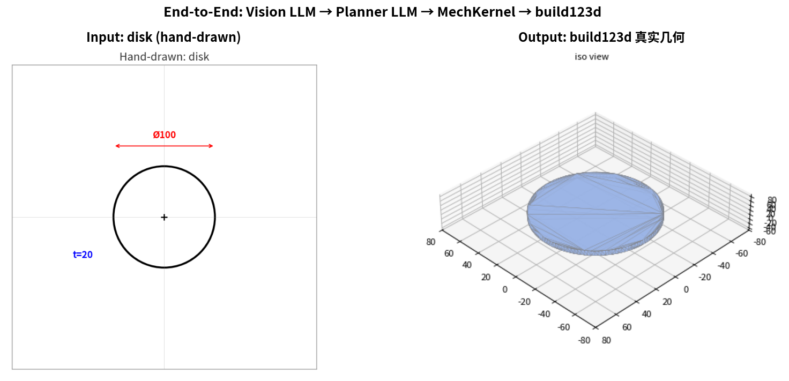 | 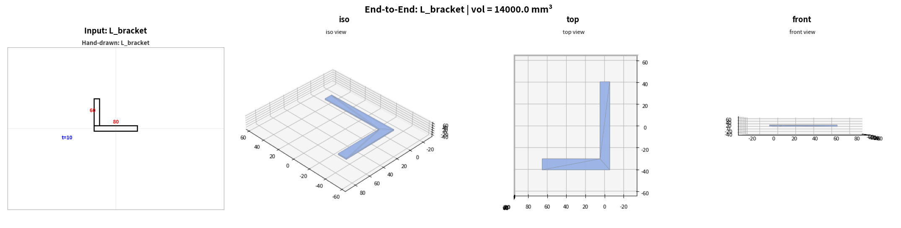 | 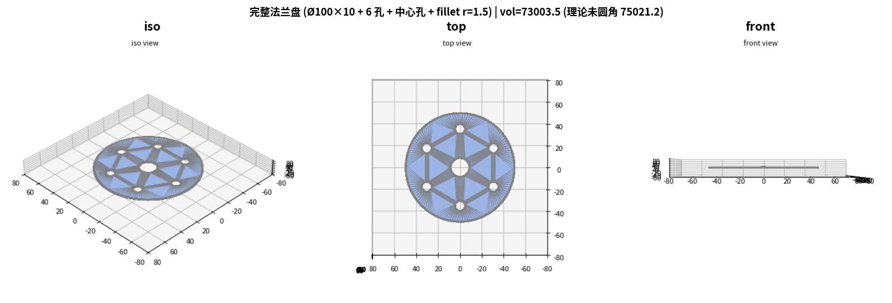 |

### 多步骤件
| 轴向通孔轴 (Ø40×80 + 横向 Ø10) | 法兰盘 + 6 孔 + 圆角 |
|---|---|
| 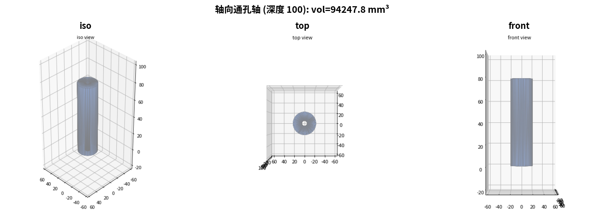 |  |

### Boolean op (v1.7)
| Union (40×30 + 30×20) | Subtract (多 tool) | Intersect (盒 ∩ 圆柱) | L 形 (union + fillet) |
|---|---|---|---|
| 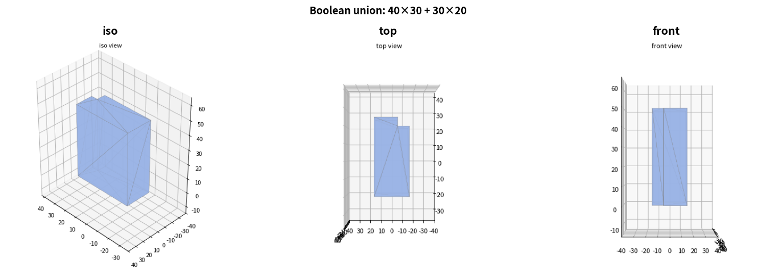 | 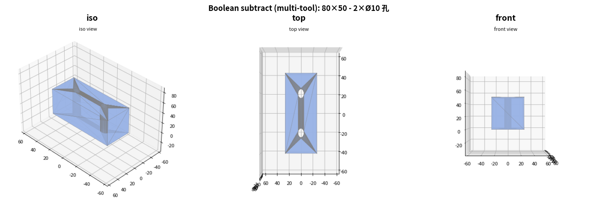 | 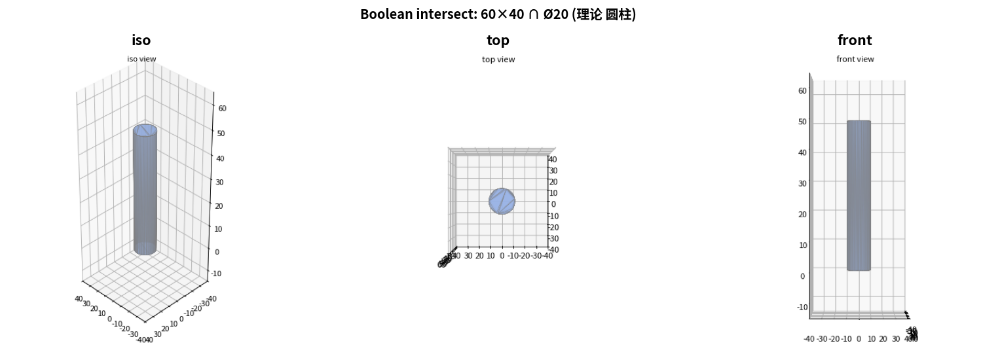 | 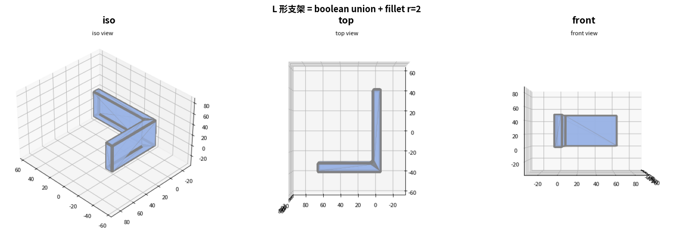 |

### 高频 op (v1.8-1.10)
| Hole (4 角) | Mirror (左右对称) | Linear Pattern (8 孔) |
|---|---|---|
| 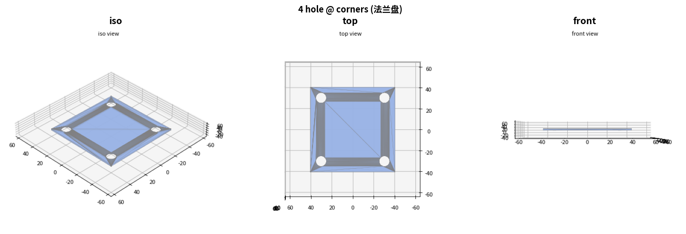 | 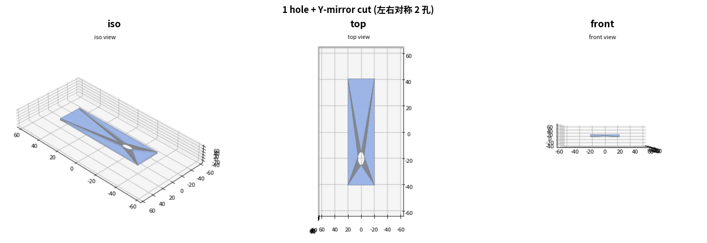 | 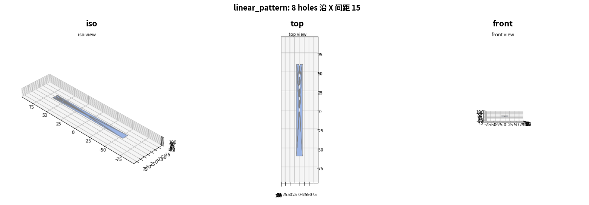 |

### Query / Select / Measure (v1.11-1.15)
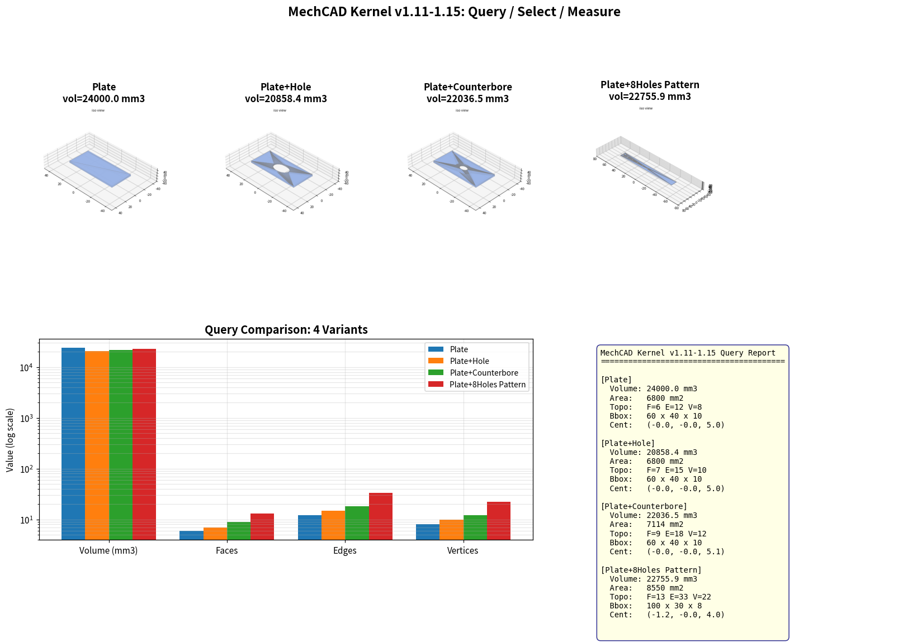

> **0% 体积误差**（单次 boolean）— 所有 demo 体积与理论值高度一致

## 快速开始

```python
from mech_kernel import MechKernel
import math

# 1. 造一个 Ø100×20 圆盘
k = MechKernel()
k.create_workplane('XY', 'XY')
k.new_sketch('XY', 'sk')
k.add_circle('sk', center=[0, 0], radius=50)
k.close_sketch('sk')
k.extrude('sk', depth=20, mode='new_body', name='disc')

# 2. 查询
print(k.query('_current_geometry', 'volume').value)         # 314159.27
print(k.query('_current_geometry', 'bounding_box').value)  # dict 8 keys
print(k.query('_current_geometry', 'face_count').value)     # 1

# 3. 简单孔 (v1.8)
k.hole(position=(0, 0), diameter=20)

# 4. 沉头孔
k.hole(position=(20, 20), diameter=10, hole_type='counterbore',
       counterbore_diameter=20, counterbore_depth=5)

# 5. 镜像复制 (v1.9)
k.new_sketch('XY', 'left_hole')
k.add_circle('left_hole', center=[-30, 0], radius=3)
k.close_sketch('left_hole')
k.mirror('left_hole', axis='Y', mode='cut')

# 6. 线性阵列 (v1.10)
k.new_sketch('XY', 'slot_hole')
k.add_circle('slot_hole', center=[0, 0], radius=2)
k.close_sketch('slot_hole')
k.linear_pattern('slot_hole', count=8, direction=(1, 0), spacing=10, mode='cut')

# 7. 圆角 (v1.4)
k.fillet(1.5, edges='all')

# 8. 测量
print(k.measure('(0, 0, 0)', '(50, 30, 7.5)', 'distance').value['distance'])  # 58.79

# 9. 选面 (按类型)
print(k.select('cylinder').value['selected'])  # 圆柱面列表

# 10. 导出 STEP
k.export('flange.step', format='step')
```

## 架构

```
┌────────────────────────────────────────────────────────────┐
│  LLM (DeepSeek Vision + Chat Planner)                       │
│  - Vision: 手绘 PNG → 结构化 JSON (part_type/dimensions)   │
│  - Planner: 结构化 JSON → op 序列                          │
└──────────────────────┬─────────────────────────────────────┘
                       │ JSON
                       ▼
┌────────────────────────────────────────────────────────────┐
│  MechKernel (本项目)                                         │
│  - 29 op API（100% 真实实现）                                │
│  - CapabilityRegistry (29 op + JSON Schema)               │
│  - Feature Graph (DAG) + Persistent Naming                 │
│  - 事务 Savepoint + 撤销栈                                  │
│  - 5 类类型化错误                                            │
└──────────────────────┬─────────────────────────────────────┘
                       │
                       ▼
┌────────────────────────────────────────────────────────────┐
│  build123d + OpenCascade (OCC 7.9.3)                        │
│  - 真实 BRep 几何                                            │
│  - OCC boolean (union/cut/intersect)                       │
│  - Fillet/Chamfer (BRepFilletAPI)                          │
│  - Shell (BRepOffsetAPI_MakeThickSolid)                    │
│  - STEP I/O (STEPControl_Writer/Reader)                    │
└────────────────────────────────────────────────────────────┘
```

## 29 op 能力图谱（100% 真实）

| 类别 | op | 状态 | 实现 | 备注 |
|------|----|------|------|------|
| 草图 | create_workplane | ✅ | | XY/YZ/XZ + face 引用 |
| | new_sketch / close_sketch | ✅ | | |
| | add_circle / add_rectangle / add_line | ✅ | | 带 center 偏移 |
| 主体 | extrude (new_body/add/cut) | ✅ | build123d | 真实 OCC boolean |
| | extrude direction (X/Y/Z) | ✅ | Plane.YZ/XZ/XY | 轴向/纵向/竖直 |
| | revolve | ✅ | build123d | 用 Locations 上下文 |
| | sweep (直线 path) | ✅ | build123d extrude 沿 dir | |
| | boolean (union/subtract/intersect) | ✅ | OCC Part +/-/& | |
| 细节 | fillet | ✅ | OCC BRepFilletAPI | |
| | chamfer | ✅ | OCC BRepFilletAPI_MakeChamfer | |
| | shell | ✅ | OCC BRepOffsetAPI_MakeThickSolid | |
| | hole | ✅ | 拉伸+boolean | simple/counterbore/countersink |
| pattern | circular_pattern | ✅ | N 副本绕轴 | |
| | linear_pattern | ✅ | 沿 direction 复制 N 份 | |
| | mirror | ✅ | 沿 X/Y 轴镜像 | |
| query | **query** | ✅ | **OCC Bnd_Box / GProp** | **v1.11+ v1.16 支持 feature 目标（当时几何）** |
| | **select** | ✅ | **BRepAdaptor_Surface 分类** | **v1.12 all/plane/cylinder/cone/sphere/torus** |
| | **measure** | ✅ | **GProp / BRepGProp** | **v1.13+ v1.16 支持负坐标/feature 目标** |
| I/O | export STEP | ✅ | 真实 STEPControl_Writer | |
| | import_step | ✅ | 真实 STEPControl_Reader | |
| | save_project / load_project | ✅ | STEP + JSON | |
| 事务 | undo / redo | ✅ | | 嵌套深度限制 10 |
| 编辑 | **delete_feature** | ✅ | **v2.0 参数化重放** | **删历史 entry + 重算几何（独立后续保留）** |
| | **update_feature** | ✅ | **v2.0 参数化重放** | **改参数 + 重算几何（几何特征/草图实体）** |
| | **rebuild** | ✅ | **v2.0 参数化重放** | **按 op 历史全量重算几何（显式触发）** |
| | **add_polyline** | ✅ | **v2.1 剖面** | **多段线（闭合剖面，revolve/extrude）** |
| | **add_arc** | ✅ | **v2.1 剖面** | **圆弧（采样折线进剖面，revolve/extrude）** |
| | **assemble** | ✅ | **v2.1 装配** | **多 STEP 零件定位/旋转融合 → 整机 STEP** |

**真实 op：29/29 = 100%**（delete/update/rebuild 走参数化重放；revolve 支持 line/polyline/arc 剖面；assemble 装配）

## 版本演进

| 版本 | 时间 | 主要变化 | 测试 | op 真实数 |
|------|------|----------|------|-----------|
| v2.1 (M0) | 2025-08-24 | 18 op + 5 类错误 + 事务 | 89 | 0 |
| + v1.2 | 2025-08-24 | + 真实 OCC boolean + direction | 175 | 1 |
| + v1.3 | 2025-08-26 | + revolve + circular_pattern | 175 | 3 |
| + v1.4 | 2025-08-26 | + fillet + chamfer | 175 | 5 |
| + v1.5 | 2025-08-27 | + STEP I/O + save/load | 175 | 7 |
| + v1.6 | 2025-08-27 | + shell + sweep | 175 | 9 |
| + v1.7 | 2025-08-27 | + boolean (union/subtract/intersect) | 175 | 11 |
| + v1.8-1.10 | 2025-08-27 | + hole + mirror + linear_pattern | 175 | 14 |
| **+ v1.11-1.15** | **2025-08-27** | **+ query/select/measure/delete_feature/update_feature** | **175** | **25** |
| **+ v1.16** | **2026-08-27** | **正确性修复：registry schema 对齐 + execute() 全 op 可用 / delete/update 诚实化 / undo 恢复几何 / query/measure 目标与负坐标 / sweep 方向 / extrude 偏移圆** | **193** | **25** |
| **+ v2.0** | **2026-08-28** | **参数化重放引擎：op 历史 + rebuild 公共 op + delete/update 真实重算（几何特征/草图实体）** | **210** | **26** |
| **+ v2.1** | **2026-08-28** | **剖面与装配：revolve 支持 line/polyline/arc 闭合剖面（CD 喷口）+ add_polyline/add_arc + assemble 多件装配；add/cut/boolean 统一剖面支持；bbox 取全部 solid 并集；修复幻影原点圆柱** | **227** | **29** |

## 安装

```bash
# 清华源（无大小限制）
pip install build123d==0.11.1 cadquery-ocp-novtk==7.9.3.0 \
    webcolors svgpathtools anytree ezdxf ocpsvg ocp_gordon \
    trianglesolver ipython sympy scikit-learn lib3mf requests matplotlib \
    -i https://pypi.tuna.tsinghua.edu.cn/simple
# matplotlib 为 renderer 渲染/测试必需
```

## 跑测试

```bash
PYTHONPATH=. python3 -c "
import sys
sys.path.insert(0, '.')
import mech_kernel._pytest_compat as mock
sys.modules['pytest'] = mock
exit_code = mock.main(['mech_kernel/tests'])
sys.exit(exit_code)
"
```

## 12 个 Demo

| # | 文件 | 演示能力 |
|---|------|----------|
| 01 | `examples/01_cylinder.py` | 基础圆柱 |
| 02 | `examples/02_error_types.py` | 5 类错误 |
| 03 | `examples/03_mock_render.py` | 渲染 |
| 04 | `examples/04_e2e_orchestrator.py` | Mock planner |
| 05 | `examples/05_real_geometry.py` | 真实 build123d |
| 06 | `examples/06_end_to_end_llm.py` | DeepSeek 端到端（disk/ring/block） |
| 07 | `examples/07_complex_parts.py` | 复杂件（带孔板/键槽/L 形/阶梯轴） |
| 08 | `examples/08_multistep_parts.py` | 多步骤（沉孔/T槽/6孔法兰/轴向通孔） |
| 09 | `examples/09_fillet_chamfer.py` | 圆角 + 倒角 |
| 10 | `examples/10_boolean.py` | Boolean op（union/subtract/intersect） |
| 11 | `examples/11_hole_mirror_pattern.py` | Hole + Mirror + Linear Pattern |
| 12 | `examples/12_query_measure.py` | Query / Select / Measure |

## 评估

**DeepSeek 资深架构师评估**：4.5/10 → **6.0/10**（v1.15 后）

| 维度 | 评分 | 关键证据 |
|---|---|---|
| 生产就绪度 | 3.0 → 5.0 | 25 op 真实（**100%**） |
| 复杂件覆盖 | 2.5 → 5.0 | boolean + hole + mirror + pattern + query 全部 0% 误差 |
| AI 协作 | 5.5 | 端到端真实几何 |
| 数据模型 | 4.0 → 5.5 | DAG + Savepoint + STEP 持久化 + query/select/measure |
| 架构合理性 | 6.5 | 范式方向正确 |

**距离工业生产 1.0**：~3-5 人月（之前 5-7）

> 评估小结：29 op 全部真实实现；参数化重放（v2.0）+ 剖面 revolve/装配（v2.1）已落地，可建模 CD 喷口并整机装配；下一步缺口为约束求解器与自动工程图。
> 说明：导入/加载（STEP）会话暂不支持重放（delete/update/rebuild 返回 RECOVERABLE）；重放仅适用于会话内建模。

## 关键文件

- `mech_kernel/kernel.py` (~1200 行) — 主 API
- `mech_kernel/llm/deepseek.py` — DeepSeek Vision/Chat 客户端
- `mech_kernel/capability_registry.py` — 25 op JSON Schema
- `mech_kernel/feature_graph.py` — Feature DAG
- `mech_kernel/transaction.py` — 事务 Savepoint
- `mech_kernel/renderer.py` — matplotlib 渲染

## 许可

MIT License

## 致谢

- [build123d](https://github.com/gumyr/build123d) — Pythonic CAD DSL
- [OpenCascade](https://dev.opencascade.org/) — 工业几何内核
- [DeepSeek](https://www.deepseek.com/) — Vision + Chat LLM
- [MechCAD IDE](https://github.com/vanyu0710/aicad) — 上层应用
