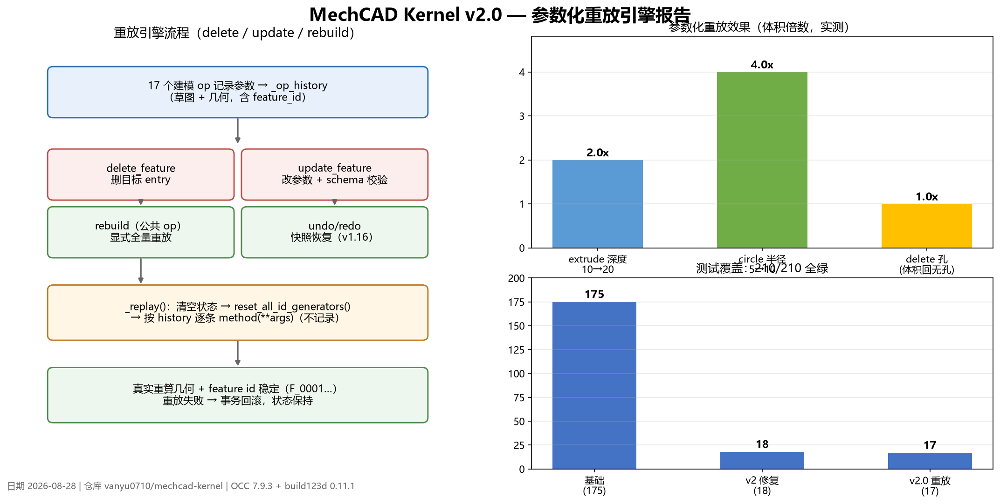

# MechCAD Kernel v2.0 — 参数化重放引擎报告

> 日期：2026-08-28 ｜ 仓库：vanyu0710/mechcad-kernel ｜ OCC 7.9.3 + build123d 0.11.1

## 一、目标

让 `delete_feature` / `update_feature` 从"只改元数据"升级为**真实重算几何**，并新增公共 op `rebuild` 显式触发全量重放。这是距离 SW 式"改参数→rebuild"可编辑性的关键一步（此前列为 v2.0 缺口）。

## 二、实现机制

- **Op 历史（`_op_history`）**：17 个建模 op（create_workplane / new_sketch / add_circle / add_rectangle / add_line / close_sketch / extrude / revolve / sweep / boolean / hole / fillet / chamfer / shell / linear_pattern / circular_pattern / mirror）在事务内记录参数（deepcopy），几何特征回填 `F_xxxx`、草图实体回填 `E_xxxx`。失败 op 由事务回滚自动清理记录。
- **重放引擎（`_replay()`）**：清空状态 → `reset_all_id_generators()`（保证 id 确定性）→ 按历史逐条 `method(**args)`（`_replaying` 抑制再记录）。任一 op 失败抛错 → 外层事务整体回滚。
- **delete_feature**：只删目标 entry + 全量重放（独立后续保留，SW 式）；真依赖被删特征的后续 op 重放失败 → 回滚并报错。
- **update_feature**：改目标 entry 参数（复用 registry schema 校验）→ 全量重放；支持几何特征与草图实体。
- **rebuild（第 26 个公共 op）**：显式全量重算，返回重放数 / feature 数 / 体积。
- **非重放会话保护**：含 `import_step` / `load_project` 的会话，delete/update/rebuild 返回 `RECOVERABLE`，不静默丢失导入几何。

## 三、验证结果

- **测试 210/210 全绿**：基础 175 + v2 修复 18 + v2.0 重放 17。
- 实测参数化效果：
  - 改 extrude 深度 10→20 → 体积 ×2.0
  - 改 circle 半径 5→10 → 体积 ×4.0（平方关系）
  - delete 孔 → 体积精确回到无孔状态
- 重放后 feature id 稳定（`F_0001`…），undo/redo 可回退 delete/update。

## 四、已知限制

- 导入/加载（STEP）会话暂不支持重放。
- ID 生成器为模块级全局，同一进程多 kernel 实例共享计数器。
- 重放为全量重算，零件 op 数 <50 时性能可接受；历史暂未随 `save_project` 持久化。
- 重放失败时报错而非静默部分重建（诚实优先）。
